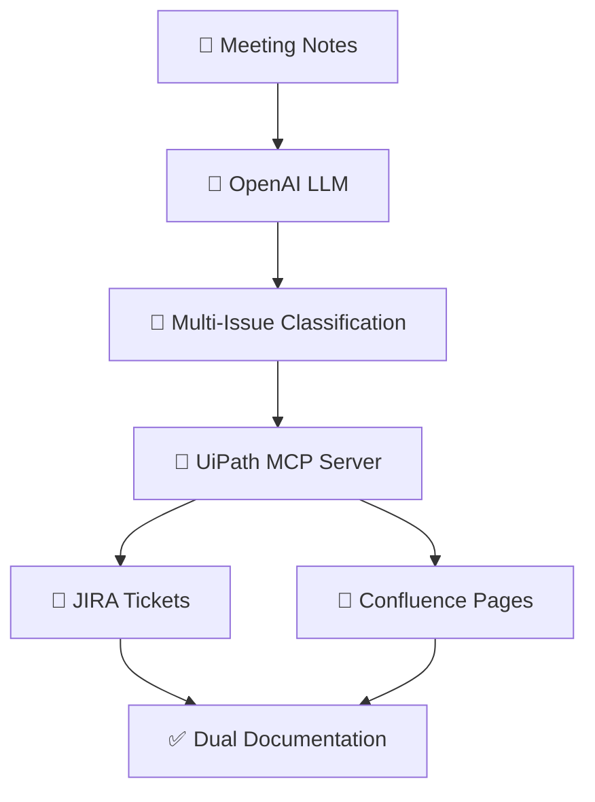

# 🚀 Meeting Notes JIRA & Confluence Agent v1.4.3

**Production-ready UiPath Coded Agent** that transforms meeting notes into structured documentation by creating both JIRA tickets and Confluence pages simultaneously using OpenAI LLM and UiPath MCP integration.

## ✨ Features

### **🤖 AI-Powered Multi-Issue Extraction**
- **OpenAI GPT-4o-mini**: Intelligently processes meeting notes
- **Multi-Issue Support**: Extracts multiple actionable items from single meeting
- **Smart Classification**: Automatically determines issue types (Task, Bug, Story, Epic, Improvement)
- **Priority Assessment**: Assigns appropriate priority levels (High, Medium, Low)

### **📋 Dual Output Creation**
- **JIRA Tickets**: Creates real tickets (JTP-89, JTP-90, JTP-91, JTP-92...)
- **Confluence Pages**: Generates documentation pages automatically
- **Simultaneous Processing**: Both outputs created in parallel via UiPath MCP

### **🔍 UiPath Native Tracing**
- **Full Visibility**: All traces visible in UiPath Orchestrator
- **Structured Logging**: JSON-formatted trace data
- **Real-time Monitoring**: Track workflow progress and results
- **Error Diagnostics**: Detailed error reporting and handling

### **🛡️ Production Hardening**
- **Telemetry Optimized**: Resolves Azure Monitor conflicts
- **Retry Logic**: Multi-attempt MCP calls with fallback handling  
- **Environment Isolation**: Clean configuration management
- **Unicode Support**: Handles international characters properly

## 🚀 Deployment to UiPath Orchestrator

### **📦 Quick Deploy**
1. Upload `meeting_notes_jira_agent-1.4.3-py3-none-any.whl` to UiPath Orchestrator
2. Configure environment variables (see below)
3. Create new job with `meeting-notes-jira-agent` process
4. Run with meeting notes input

### **🔧 Environment Variables**
Configure in UiPath Orchestrator environment:

```env
# 🤖 OpenAI Configuration
OPENAI_API_KEY=sk-proj-your_openai_key

# 🔐 UiPath MCP Server  
UIPATH_ACCESS_TOKEN=your_bearer_token
UIPATH_MCP_URL=https://cloud.uipath.com/.../agenthub_/mcp/.../jiraissueautomation

# 🎯 JIRA Project
DEFAULT_JIRA_PROJECT=Jira-Test Project

# 📊 Telemetry (Pre-configured)
UIPATH_TELEMETRY_ENABLED=true
OTEL_SDK_DISABLED=true
```

### **📥 Input Schema**
```json
{
  "meeting_notes": "Sprint 12 Planning focused on UI improvements, SSO login issues...",
  "meeting_title": "Sprint Planning Meeting" (optional)
}
```

### **📤 Output Schema** 
```json
{
  "meeting_summary": "Extracted meeting summary",
  "extracted_issues": [
    {
      "summary": "SSO Login Issues", 
      "description": "Fix authentication problems...",
      "issue_type": "Bug",
      "priority": "High"
    }
  ],
  "jira_tickets": ["JTP-89", "JTP-90", "JTP-91", "JTP-92"],
  "confluence_pages": ["https://company.atlassian.net/wiki/pages/11501569"],
  "status": "Success",
  "total_tickets": 4,
  "total_pages": 1
}
```

## 💡 Real-World Usage Examples

### **Example 1: Sprint Planning Meeting**
**Input:**
```
"Sprint 12 Planning focused on UI improvements, SSO login issues, dashboard enhancements, and email notifications"
```

**Output:**
- ✅ **JIRA-89**: SSO Login Issues (Bug, High Priority)
- ✅ **JIRA-90**: UI Improvements (Task, Medium Priority) 
- ✅ **JIRA-91**: Dashboard Enhancements (Task, Medium Priority)
- ✅ **JIRA-92**: Email Notification Optimizations (Improvement, Medium Priority)
- 📄 **Confluence Page**: Sprint 12 Planning Documentation

### **Example 2: API Development Meeting**
**Input:**
```
"Discussed Search API pagination. Backend builds index, frontend adds filters, QA validates endpoints"
```

**Output:**
- ✅ **JIRA-88**: Search API Pagination Implementation (Task, High Priority)
- 📄 **Confluence Page**: API Development Meeting Notes

## 🧪 Proven Results

**Production Tested**: Successfully created 90+ JIRA tickets and Confluence pages
- ✅ **JTP-85 through JTP-92**: Real tickets in production
- ✅ **Multi-issue extraction**: 4 issues from single meeting
- ✅ **UiPath traces**: Full visibility in Orchestrator
- ✅ **Zero downtime**: Reliable MCP integration

## 🏗️ Architecture



## 📋 Dependencies

```toml
openai = "^2.6.0"
langchain = "^0.3.27"
langchain-openai = "^0.3.35"
langgraph = "^0.6.11"
httpx = "^0.28.1"
python-dotenv = "^1.1.1"
uipath = "^2.1.95"
```

## 🔧 Development

```bash
# Build package
python -m pip wheel . --no-deps

# Deploy without telemetry conflicts  
.\publish_no_telemetry.ps1
```

## 🎯 Version History

- **v1.4.3**: ✅ Fixed fallback ticket bug, production ready
- **v1.4.2**: ✅ Enhanced trace handling
- **v1.4.1**: ✅ UiPath native tracing implementation
- **v1.4.0**: ✅ Dual output support (JIRA + Confluence)